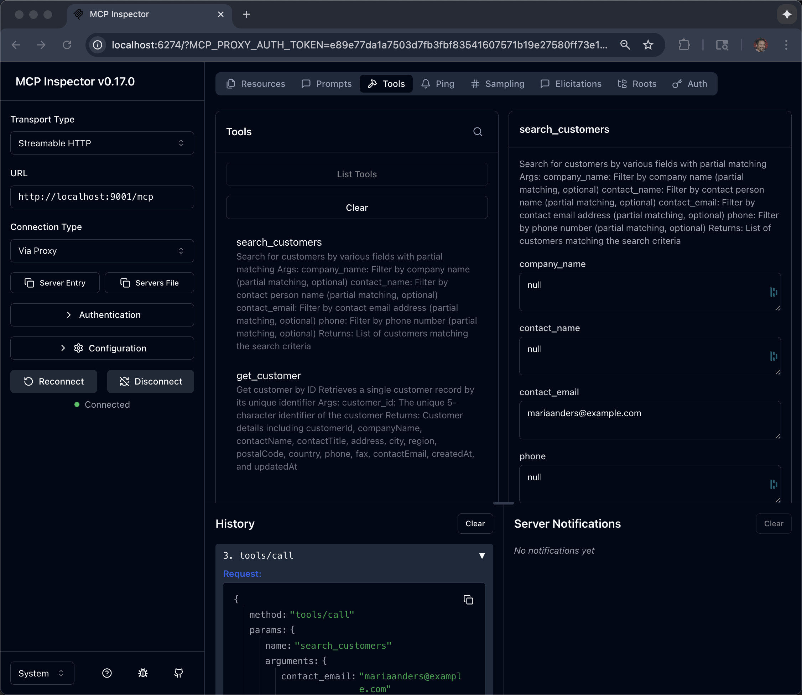

# Customer MCP

Works with this backend API

https://github.com/burrsutter/fantaco-customer-main


## Local testing

```bash
cd customer-mcp
```

```bash
export CUSTOMER_API_BASE_URL="where-your-customer-API-is"
```

```bash
python3 -m venv .venv
source .venv/bin/activate
```

```bash
python customer-api-mcp-server.py
```

```bash
mcp-inspector
```



## Customer MCP Kubernetes/OpenShift Deployment

First build a container image

```bash
brew install podman 
podman machine start

podman login quay.io
```

```bash
podman build --arch amd64 --os linux -t quay.io/burrsutter/mcp-server-customer:1.0.0 .
```

```bash
podman push quay.io/burrsutter/mcp-server-customer:1.0.0
```

Test the container image

```bash
podman run \
  -p 9001:9001 \
  quay.io/burrsutter/mcp-server-customer:1.0.0
```

## Deploy to Kubernetes/OpenShift

```bash
kubectl apply -f customer-mcp-kubernetes/
```

```bash
export MCP_CUST_URL=https://$(oc get routes -l app=mcp-customer -o jsonpath="{range .items[*]}{.status.ingress[0].host}{end}")/mcp
echo $MCP_CUST_URL
```

Use `mcp-inspector` to test this OpenShift hosted MCP server

# Finance MCP

```bash
cd finance-mcp
```

```bash
python3 -m venv .venv
source .venv/bin/activate
```


```bash
export FINANCE_API_BASE_URL="where-your-finance-API-is"
```


```bash
python finance-api-mcp-server.py
```

```bash
mcp-inspector
```

## Finance MCP Kubernetes/OpenShift Deployment

First build a container image

```bash
brew install podman 
podman machine start

podman login quay.io
```

```bash
podman build --arch amd64 --os linux -t quay.io/burrsutter/mcp-server-finance:1.0.0 .
```

```bash
podman push quay.io/burrsutter/mcp-server-finance:1.0.0
```

Test the container image

```bash
podman run \
  -p 9002:9002 \
  quay.io/burrsutter/mcp-server-finance:1.0.0
```


## Deploy to Kubernetes/OpenShift

```bash
kubectl apply -f finance-mcp-kubernetes/
```

```bash
export MCP_FIN_URL=https://$(oc get routes -l app=mcp-finance -o jsonpath="{range .items[*]}{.status.ingress[0].host}{end}")/mcp
echo $MCP_FIN_URL
```

Use `mcp-inspector` to test this OpenShift hosted MCP server
