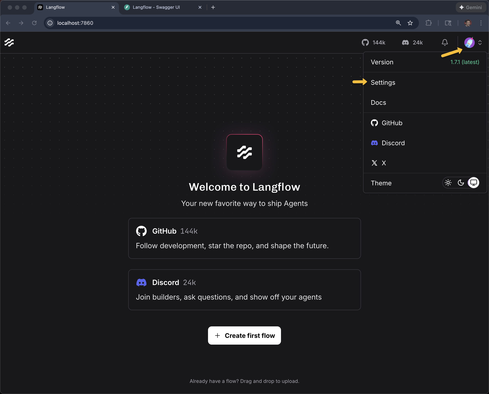
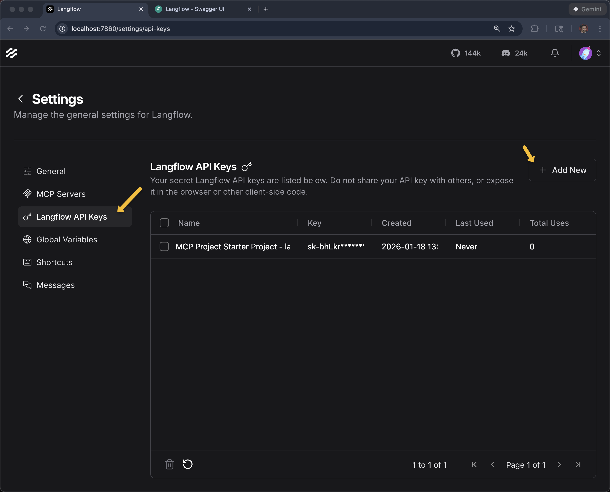
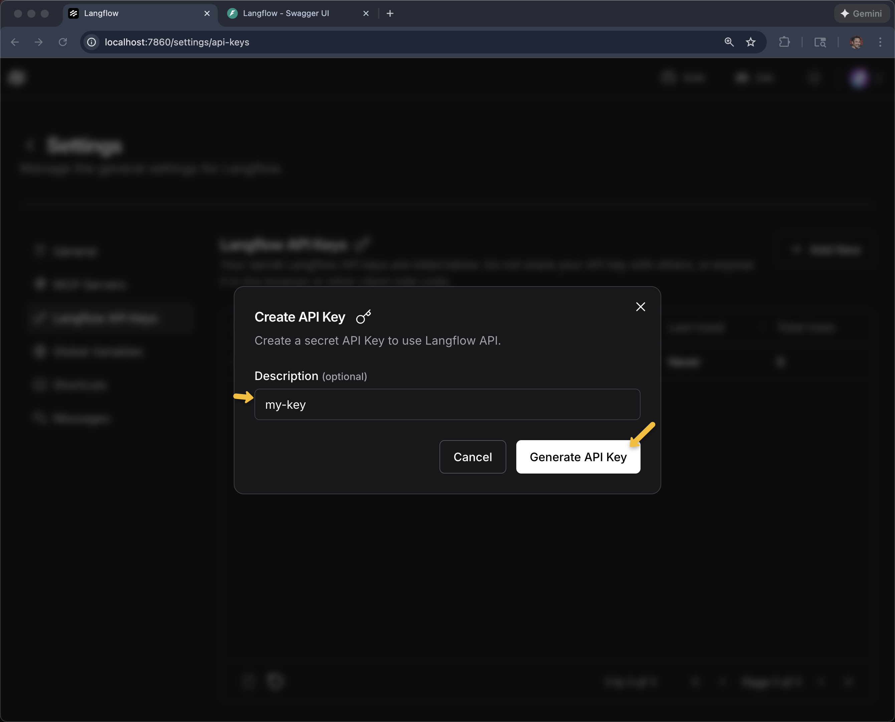
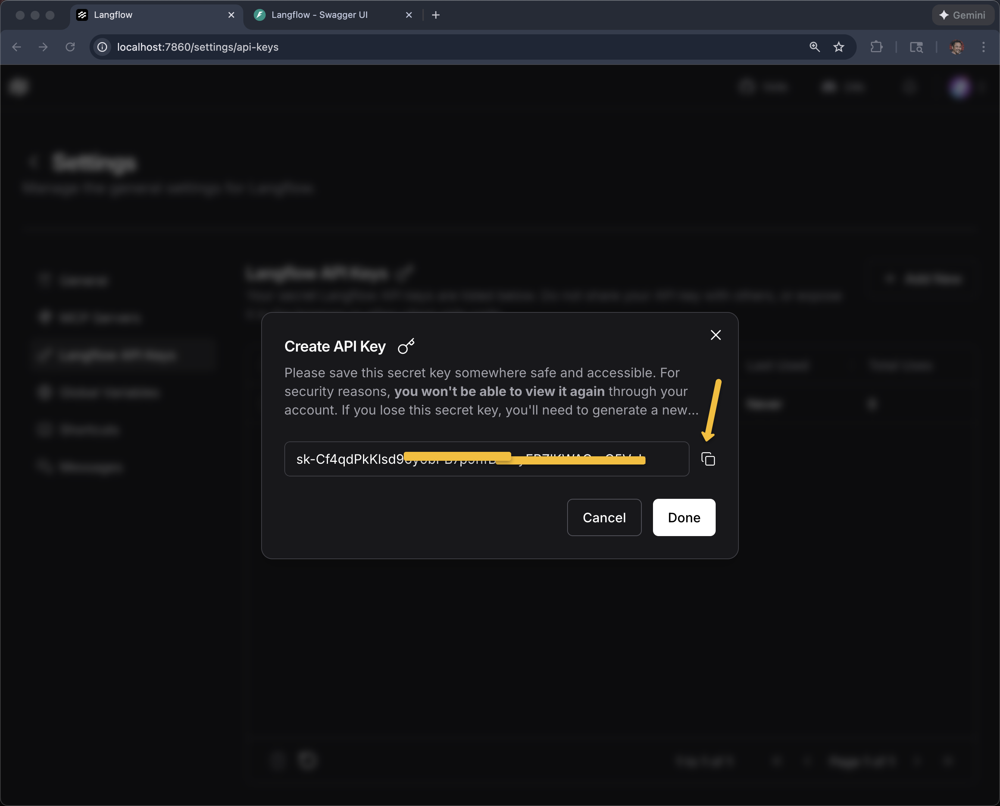
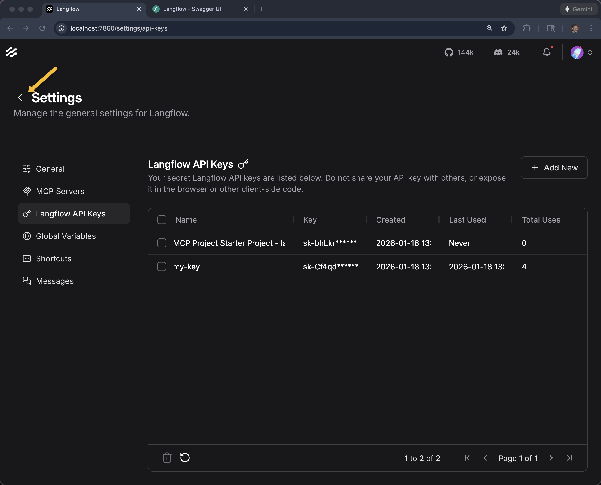
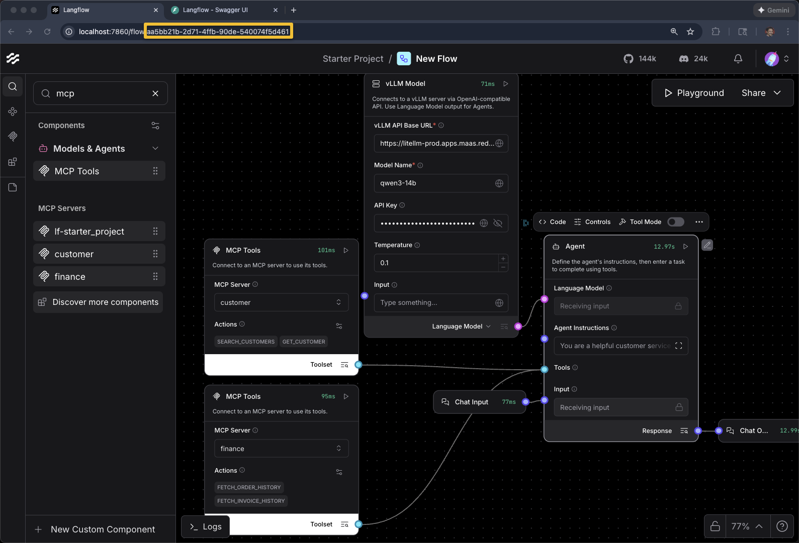
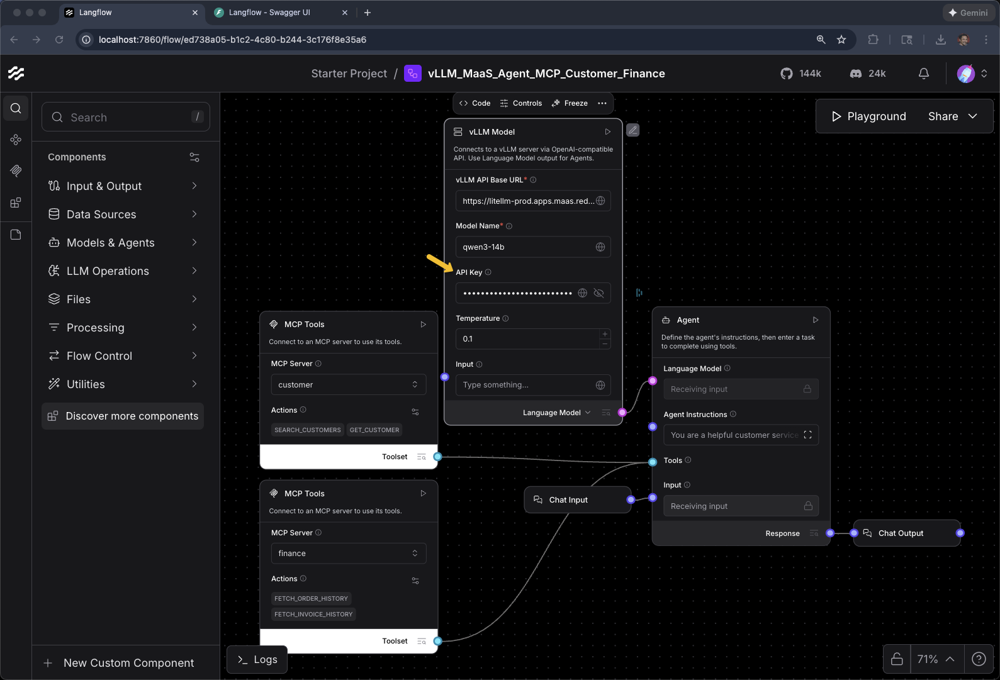
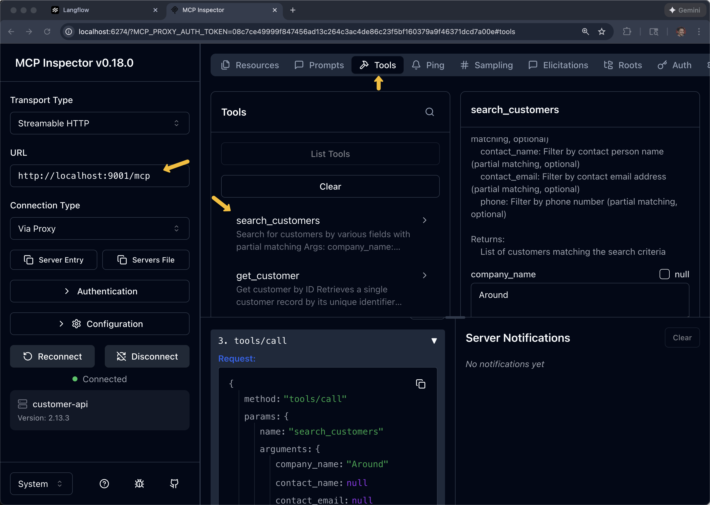

# Langflow


## Localhost Installation

```bash
python3.12 -m venv .venv
source .venv/bin/activate
```

```bash
python -V
uv run python -V
```

```
Python 3.12.12
```

```
pip install langflow==1.7.1
```

or

```bash
pip install -r requirements.txt
```

```bash
langflow --version
```

```
Langflow version: 1.7.1
```

```bash
langflow run
```

```bash
export LANGFLOW_URL=http://localhost:7860
export LANGFLOW_DOCS_URL=http://localhost:7860/docs
```

```bash
open $LANGFLOW_URL
open $LANGFLOW_DOCS_URL
```

## OpenShift Installation 

As Cluster Admin


```bash
helm repo add langflow https://langflow-ai.github.io/langflow-helm-charts
helm repo update
```

```bash
helm install langflow-ide langflow/langflow-ide \
  --set langflow.backend.resources.limits.cpu=1 \
  --set langflow.backend.resources.limits.memory=2Gi \
  --set langflow.frontend.resources.limits.cpu=500m \
  --set langflow.frontend.resources.limits.memory=1Gi \
  --set serviceAccount.create=false
```


```bash
watch oc get pods 
```

```
NAME                                         READY   STATUS              RESTARTS   AGE
langflow-service-0                           0/1     ContainerCreating   0          18s
langflow-service-frontend-84dcb78879-rwrm6   1/1     Running             0          18s
```

```bash
oc get statefulset
NAME               READY   AGE
langflow-service   0/1     6m54s
```

Wait a bit before running the fix script

```bash
./fix-langflow-probes.sh
```

Create route for frontend

```bash
oc create route edge langflow-service --service=langflow-service -n langflow
```

And create a route for backend as that is helpful to Claude Code and provides better API access

```bash
oc create route edge langflow-backend-docs --service=langflow-service-backend --port=7860 -n langflow
```

```bash
export LANGFLOW_URL=https://$(oc get routes -l app=langflow-service -o jsonpath="{range .items[*]}{.status.ingress[0].host}{end}")
export LANGFLOW_DOCS_URL=https://$(oc get route langflow-backend-docs -n langflow -o jsonpath='{.spec.host}')
```

## GUI

```bash
open $LANGFLOW_URL
```

Swagger/OpenAPI 

```bash
open $LANGFLOW_DOCS_URL/docs
```

### API Keys for curl and Claude Code 

Go into Settings, API Keys to give Claude Code access to Langflow










```bash
export LANGFLOW_API_KEY=sk-jCbsqGPRE3FqqEPlvwcpqpi7-u7A_WxsTCir3J9kFFk
```

Provide LANGFLOW_URL, LANGFLOW_DOCS_URL and LANGFLOW_API_KEY as context to your coding agent (e.g. Claude Code) means it can help you debug problems with your flows.  




## Hello World 

Create a new flow - Click **Create first flow**


Click **Blank Flow**


Drag a **Text Input** component onto the canvas


Drag a **Chat Output** component onto the canvas


Connect them together (drag from the output node to the input node)

    

Provide a message **Hello Aloha Bonjour**

Click the **Playground** button 


Using this icon to get back to the list of all projects and flows


You can use the ellipses **...** on the Project or Flow to make changes such as its name 


## vLLM MaaS

Langflow does **NOT** have an out-of-the-box (OOTB) Component that works with vLLM via MaaS where you need to override:

* API URL 
* API Key
* Model Name

Insure you have connectivity to the vLLM MaaS by asking for a list of available models

```bash
curl -sS https://litellm-prod.apps.maas.redhatworkshops.io/v1/models   -H "Authorization: Bearer sk-dV5UNeAWHskJK" | jq
```

URL

```
https://litellm-prod.apps.maas.redhatworkshops.io/v1
```

Model Name (based on the curl command above)

```
qwen3-14b
```

API Key

```
sk-dV5UNeAWHskJK
```

**+ New Flow**

**+ Blank Flow**

We have a custom component. Click **+New Custom Component**


Click **Code**

Delete the current code


Paste in the contents of **vllm_model_component.py**


Click **Check & Save**

Enter the URL, Model Name and API Key

Change **Language Model** to **Response** (we will Language Model later)


Add a **Chat Input** and **Chat Output** and connect the dots


Click **Playground**

**what model are you?**


## Agent with vLLM

Remove Chat Input and Chat Output (for now).  Find "Agent" in the list of Components


Add an Agent 

Change the output of the vLLM Model Component to be "Language Model" 

And

Click on "Model Provider"


**+ Connect other models**


Awaiting model input...


Connect the vLLM Model to Agent


Add Chat Input and Chat Output to the Agent


Add MCP Component for Customer

Drag **MCP Tools** Component to the canvas

Click on **Select a server...**


Click **+ Add MCP Server**


Select **Streamable HTTP/SSE**

Name: Customer

Streamable HTTP/SSE URL

http://localhost:9001/mcp

or your OpenShift hosted endpoint

Click **Add Server**


Toggle Tool Mode


When Response switches to Toolset, you can then connect it to the Agents Tools input


Playground and test with "who does Thomas Hardy work for?"

Remember, you are dealing with a LLM and it non-determinstic behavior. In some cases, this query will result in 

"Thomas Hardy was an English novelist and poet, best known for his works such as Tess of the d'Urbervilles and Far from the Madding Crowd. He was a prolific writer during the 19th and early 20th centuries. As he passed away in 1928, he does not work for anyone today. If you're referring to a different person named Thomas Hardy, feel free to clarify!"

Keep going


Add MCP Component for Finance


**+ Add MCP Server**


Select **Streamable HTTP/SSE**

Name: Finance

Streamable HTTP/SSE URL

http://localhost:9002/mcp

or your OpenShift hosted endpoint

Click **Add Server**


Toggle Tool Mode


Connect MCP Servers to Agent Tools input


What are the orders for Thomas Hardy?


To help the Agent out, especially when using smaller open models, you need a better System Prompt

Add **Agent Instructions**


```
You are a helpful customer service assistant.

IMPORTANT: When ANY person's name is mentioned, ALWAYS search for them as a customer first before answering.
IMPORTANT: You MUST use tools to answer questions about customers or orders. Never guess or use general knowledge.

TOOLS AND THEIR EXACT PARAMETERS:
- search_customers(contact_name="Name") - search by customer name
- get_customer(customer_id="ID") - get customer details
- fetch_order_history(customer_id="ID") - get orders
- fetch_invoice_history(customer_id="ID") - get invoices

WORKFLOW for customer questions:
1. Call search_customers(contact_name="<customer name>")
2. Extract customer_id from results
3. Use that customer_id for other queries

Always use tools first. Never answer from general knowledge about people.   
```


## Curl

Find your Flow ID



Make sure your LANGFLOW_URL, LANGFLOW_API_KEY, and LANGFLOW_FLOW_ID are set correctly

```bash 
export LANGFLOW_URL=http://localhost:7860
export LANGFLOW_API_KEY=sk-jCbsqGPRE3FqqEPlvwcpqpi7-u7A_WxsTCir3J9kFFk
export LANGFLOW_FLOW_ID=aa5bb21b-2d71-4ffb-90de-540074f5d461
```

```bash
echo "LANGFLOW_URL="$LANGFLOW_URL
echo "LANGFLOW_API_KEY="$LANGFLOW_API_KEY
echo "LANGFLOW_FLOW_ID="$LANGFLOW_FLOW_ID
```

Then you can run a curl command targeting the flow

```bash
curl -s --compressed -X POST \
    "${LANGFLOW_URL}/api/v1/run/${LANGFLOW_FLOW_ID}" \
    -H "Content-Type: application/json" \
    -H "x-api-key: ${LANGFLOW_API_KEY}" \
    -d '{"input_type": "chat", "output_type": "chat", "input_value": "what are the orders for Thomas Hardy?"}' | jq -r '.outputs[0].outputs[0].results.message.text' 
```

```
Here are the most recent orders for **Thomas Hardy** (Customer ID: **AROUT**):

1. **Order #ORD-008**
   - **Date**: January 30, 2024 @ 03:20 PM
   - **Total**: $59.99
   - **Status**: PENDING

2. **Order #ORD-003**
   - **Date**: January 25, 2024 @ 09:45 AM
   - **Total**: $89.99
   - **Status**: PENDING

3. **Order #ORD-004**
   - **Date**: January 10, 2024 @ 04:20 PM
   - **Total**: $199.99
   - **Status**: DELIVERED

No new orders have been added to Thomas Hardy’s record since the last check. Let me know if you’d like to verify this information again or check for updates!
```

## Tips & Technqiues

When using Claude Code, it can be helpful to give it direct access to the two MCP servers

```bash
export CUSTOMER_MCP_SERVER_URL=http://localhost:9001/mcp
export FINANCE_MCP_SERVER_URL=http://localhost:9002/mcp
```

And the vLLM MaaS information can be useful to Claude Code as well

```bash
export BASE_URL=https://litellm-prod.apps.maas.redhatworkshops.io/v1
export INFERENCE_MODEL=qwen3-14b
export API_KEY=sk-dV5UNeAWHskJKpbN0gQ05A
```

```Claude
what components are in the flow $LANGFLOW_FLOW_ID
```

```
Flow aa5bb21b-2d71-4ffb-90de-540074f5d461 contains 6 components:
  ┌───────────────────────┬────────────┬──────────────────────┐
  │          ID           │    Type    │     Display Name     │
  ├───────────────────────┼────────────┼──────────────────────┤
  │ CustomComponent-4rRXY │ VLLMModel  │ vLLM Model           │
  ├───────────────────────┼────────────┼──────────────────────┤
  │ Agent-XRhIx           │ Agent      │ Agent                │
  ├───────────────────────┼────────────┼──────────────────────┤
  │ ChatInput-dQgak       │ ChatInput  │ Chat Input           │
  ├───────────────────────┼────────────┼──────────────────────┤
  │ ChatOutput-44mmf      │ ChatOutput │ Chat Output          │
  ├───────────────────────┼────────────┼──────────────────────┤
  │ MCPTools-ii0XJ        │ MCPTools   │ MCP Tools (customer) │
  ├───────────────────────┼────────────┼──────────────────────┤
  │ MCPTools-TMEyy        │ MCPTools   │ MCP Tools (finance)  │
  └───────────────────────┴────────────┴──────────────────────┘
```

```
what are the connections between the components?
```

```
  ┌─────────────────────────────┬─────────────┬──────────────────────────────┐
  │           Source            │   Target    │           Purpose            │
  ├─────────────────────────────┼─────────────┼──────────────────────────────┤
  │ VLLMModel → Agent           │ agent_llm   │ Language model for the Agent │
  ├─────────────────────────────┼─────────────┼──────────────────────────────┤
  │ ChatInput → Agent           │ input_value │ User message input           │
  ├─────────────────────────────┼─────────────┼──────────────────────────────┤
  │ MCPTools (customer) → Agent │ tools       │ Customer service tools       │
  ├─────────────────────────────┼─────────────┼──────────────────────────────┤
  │ MCPTools (finance) → Agent  │ tools       │ Finance tools                │
  ├─────────────────────────────┼─────────────┼──────────────────────────────┤
  │ Agent → ChatOutput          │ input_value │ Agent response output        │
  └─────────────────────────────┴─────────────┴──────────────────────────────┘
  ┌─────────────┐     ┌─────────────────┐     ┌─────────────┐
  │  ChatInput  │────▶│                 │────▶│ ChatOutput  │
  └─────────────┘     │                 │     └─────────────┘
                      │      Agent      │
  ┌─────────────┐     │                 │
  │  VLLMModel  │────▶│   (agent_llm)   │
  └─────────────┘     │                 │
                      │                 │
  ┌─────────────┐     │                 │
  │  MCPTools   │────▶│    (tools)      │
  │ (customer)  │     │                 │
  └─────────────┘     │                 │
                      │                 │
  ┌─────────────┐     │                 │
  │  MCPTools   │────▶│    (tools)      │
  │  (finance)  │     │                 │
  └─────────────┘     └─────────────────┘
```


## Adding a Flow via Curl

```bash
curl -s --compressed -X POST \
    "${LANGFLOW_URL}/api/v1/flows/" \
    -H "Content-Type: application/json" \
    -H "x-api-key: ${LANGFLOW_API_KEY}" \
    -d @flow_examples/vLLM_MaaS_Agent_MCP_Customer_Finance.json
```

Make sure to re-enter the API Key



## MCP Servers

### Localhost MCP

```bash
brew services list
```

```bash
brew services start postgresql@14
```

```bash
cd fantaco-customer-main
```

Run the Customer REST API

```bash
java -jar target/fantaco-customer-main-1.0.0.jar
```

### Quick test of Customer REST API

```bash
export CUST_URL=http://localhost:8081
curl -sS -L "$CUST_URL/api/customers?companyName=Around" | jq
```

## Start Finance Backend

```bash
cd fantaco-finance-main
```

Run the Finance REST API

```bash
java -jar target/fantaco-finance-main-1.0.0.jar
```

### Quick test for Finance REST API

```bash
export FIN_URL=http://localhost:8082
curl -sS -X POST $FIN_URL/api/finance/orders/history \
  -H "Content-Type: application/json" \
  -d '{
    "customerId": "AROUT",
    "limit": 10
  }' | jq
```

### Localhost MCP

```bash
source .venv/bin/activate
cd fantaco-mcp-servers/customer-mcp
```

```bash
python customer-api-mcp-server.py
```

## Finance MCP

```bash
source .venv/bin/activate
cd fantaco-mcp-servers/finance-mcp
```

```bash
python finance-api-mcp-server.py
```

Using `mcp-inspector` to test the MCP Servers

```bash
brew install mcp-inspector
```



### OpenShift hosted MCP 

```bash
export NAMESPACE=agentic-user1
```

```bash
export CUSTOMER_MCP_SERVER_URL=https://$(oc get routes -l app=mcp-customer -n $NAMESPACE -o jsonpath="{range .items[*]}{.status.ingress[0].host}{end}")/mcp
export FINANCE_MCP_SERVER_URL=https://$(oc get routes -l app=mcp-finance -n $NAMESPACE -o jsonpath="{range .items[*]}{.status.ingress[0].host}{end}")/mcp
echo $CUSTOMER_MCP_SERVER_URL
echo $FINANCE_MCP_SERVER_URL
```

```
https://mcp-customer-route-agentic-user5.apps.cluster-q5gsb.dynamic.redhatworkshops.io/mcp
https://mcp-finance-route-agentic-user5.apps.cluster-q5gsb.dynamic.redhatworkshops.io/mcp
```


## Langflow API 


#### List all flows
```bash
curl -s --compressed -X GET \
  "${LANGFLOW_URL}/api/v1/flows/?remove_example_flows=true&get_all=true" \
  -H "accept: application/json" \
  -H "x-api-key: ${LANGFLOW_API_KEY}" | jq '.[] | {id: .id, name: .name}'
```


```
{
  "id": "2ee6a0f1-649e-4972-9dd3-800fef17dd3f",
  "name": "Hello World"
}
{
  "id": "ed738a05-b1c2-4c80-b244-3c176f8e35a6",
  "name": "vLLM_MaaS_Agent_MCP_Customer_Finance"
}
```

```bash
export LANGFLOW_URL=http://localhost:7860
export LANGFLOW_API_KEY=sk-jCbsqGPRE3FqqEPlvwcpqpi7-u7A_WxsTCir3J9kFFk
export LANGFLOW_FLOW_ID=ed738a05-b1c2-4c80-b244-3c176f8e35a6
```

#### List all components on a flow
```bash
curl -s -H "x-api-key: $LANGFLOW_API_KEY" "${LANGFLOW_URL}/api/v1/flows/$LANGFLOW_FLOW_ID" | jq '.data.nodes[] | {id: .id, type: .data.type}'
```

```bash
curl -s -H "x-api-key: $LANGFLOW_API_KEY" "${LANGFLOW_URL}/api/v1/flows/$LANGFLOW_FLOW_ID" | jq '.data.nodes[] | {id: .id, type: .data.node.display_name}'
```


#### Get messages for a flow
```bash
curl -s -H "x-api-key: ${LANGFLOW_API_KEY}" "${LANGFLOW_URL}/api/v1/monitor/messages?flow_id=$LANGFLOW_FLOW_ID" | jq '.'
```  

#### Get a list of sessions
```bash
curl -s -H "x-api-key: ${LANGFLOW_API_KEY}" "${LANGFLOW_URL}/api/v1/monitor/messages/sessions?flow_id=$LANGFLOW_FLOW_ID" | jq '.'
```

```
[
  "ed738a05-b1c2-4c80-b244-3c176f8e35a6"
]  
```

```bash
export LANGFLOW_SESSION_ID=ed738a05-b1c2-4c80-b244-3c176f8e35a6
```


#### Get messages for a session
```bash
curl -s -H "x-api-key: ${LANGFLOW_API_KEY}" "${LANGFLOW_URL}/api/v1/monitor/messages?session_id=$LANGFLOW_SESSION_ID" | jq '.'
```  


#### To see all components within a specific category (e.g., openai):
```bash
curl -s --compressed -X GET \
    "${LANGFLOW_URL}/api/v1/all" \
    -H "accept: application/json" \
    -H "x-api-key: ${LANGFLOW_API_KEY}" | jq '.openai | keys'    
```

#### Get all properties for a specific component
  **Format: .{category}.{ComponentName}**

```bash  
curl -s --compressed -X GET \
  "${LANGFLOW_URL}/api/v1/all" \
  -H "accept: application/json" \
  -H "x-api-key: ${LANGFLOW_API_KEY}" | jq '.openai.OpenAIModel'
```

#### To get just the input fields (template properties):
```bash
curl -s --compressed -X GET \
  "${LANGFLOW_URL}/api/v1/all" \
  -H "accept: application/json" \
  -H "x-api-key: ${LANGFLOW_API_KEY}" | jq '.openai.OpenAIModel.template | keys'
```  

This returns:
```
[
  "_type",
  "api_key",
  "code",
  "input_value",
  "json_mode",
  "max_retries",
  "max_tokens",
  "model_kwargs",
  "model_name",
  "openai_api_base",
  "seed",
  "stream",
  "system_message",
  "temperature",
  "timeout"
]
```

#### To see a specific field's details:
```bash
curl -s --compressed -X GET \
  "${LANGFLOW_URL}/api/v1/all" \
  -H "accept: application/json" \
  -H "x-api-key: ${LANGFLOW_API_KEY}" | jq '.openai.OpenAIModel.template.model_name'
```

## State

Where are your flows stored

### Localhost

```bash
ls $VIRTUAL_ENV/lib/python3.12/site-packages/langflow/langflow.db*
```

```
/Users/bsutter/ai-projects/fantaco-redhat-one-2026/.venv/lib/python3.12/site-packages/langflow/langflow.db
/Users/bsutter/ai-projects/fantaco-redhat-one-2026/.venv/lib/python3.12/site-packages/langflow/langflow.db-shm
/Users/bsutter/ai-projects/fantaco-redhat-one-2026/.venv/lib/python3.12/site-packages/langflow/langflow.db-wal
```

SQLite writes these alongside the DB when WAL journaling is enabled:
	•	langflow.db-wal → the write-ahead log (recent writes)
	•	langflow.db-shm → shared memory index for WAL

Upgrades/reinstalls can blow this away, and it’s awkward for backups.


Move the location

```bash
export LANGFLOW_DATABASE_URL="sqlite:///path/to/your/langflow.db"
```

or make it relative to your current location

```bash
mkdir -p .langflow
export LANGFLOW_DATABASE_URL="sqlite:///$PWD/.langflow/langflow.db"
langflow run
```


### Export all flows

```bash
curl -s "http://localhost:7860/api/v1/flows/" \
    -H "x-api-key: $LANGFLOW_API_KEY" | jq . > flows_backup.json
```

### Reset

Option 1: Delete the database (recommended)
Stop Langflow first (Ctrl+C in the terminal running it)
Remove the database files

```bash
rm $VIRTUAL_ENV/lib/python3.12/site-packages/langflow/langflow.db*
```

Restart Langflow - it will create a fresh database

```bash
langflow run
```


